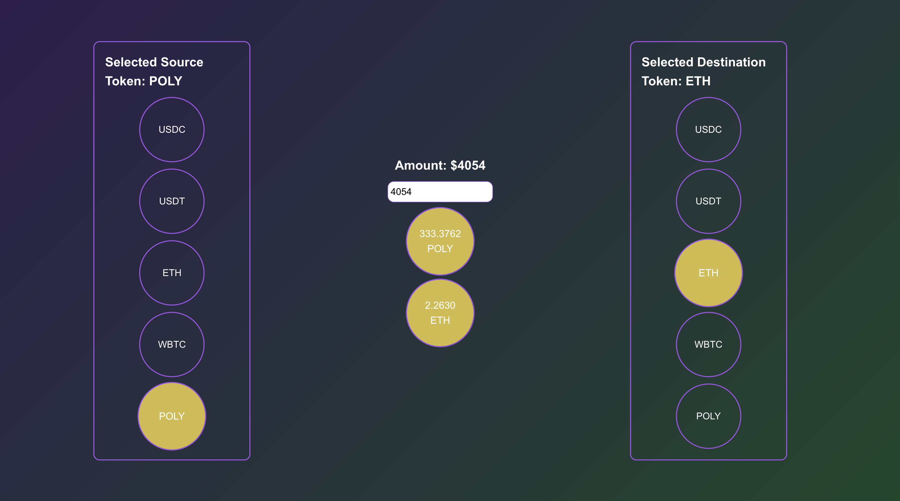
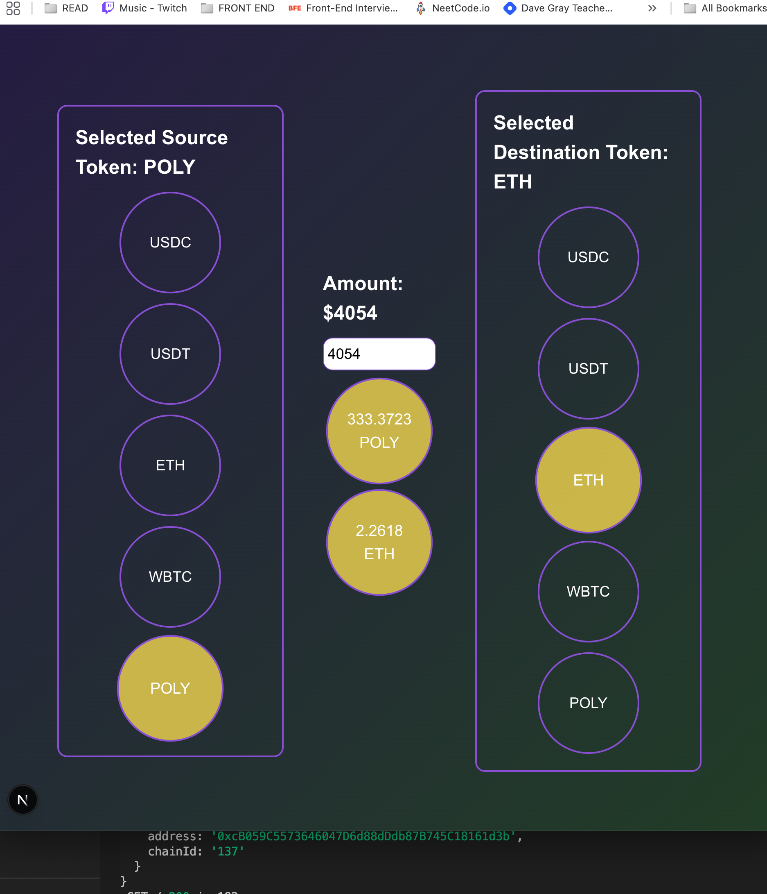
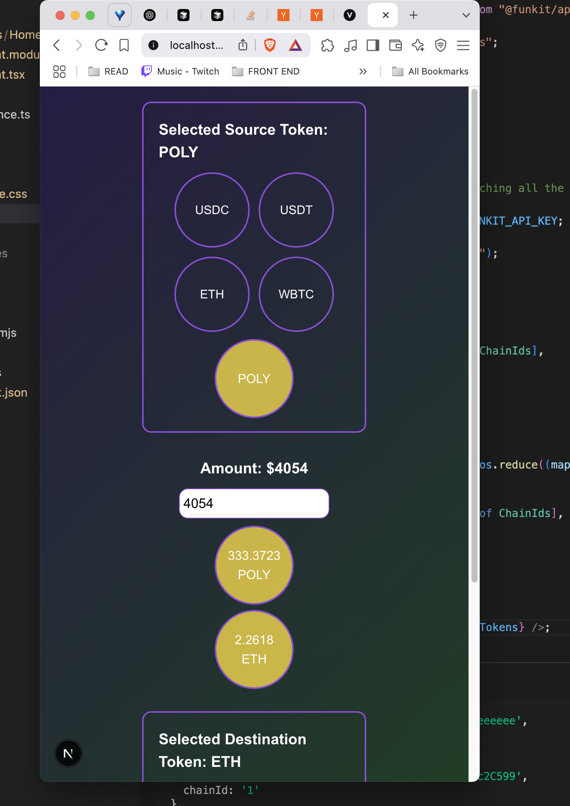

# Token Price Converter

A Next.js application that allows users to convert between different cryptocurrency tokens using real-time price data. This project demonstrates the integration with the FunKit API to fetch token prices and perform conversions.

## Screenshots

Here's how the application looks and works:










## Features

- Real-time token price fetching using FunKit API
- Support for multiple tokens (USDC, USDT, ETH, WBTC, POLY)
- Cross-chain token support (Ethereum, Polygon, Base)
- Live price updates every 3 seconds
- USD-based conversion interface
- Fully responsive and mobile-friendly design
- Optimized for all screen sizes (desktop, tablet, and mobile)

## Technical Stack

- **Framework**: Next.js 15.3.1 with TypeScript
- **State Management**: React Query (TanStack Query)
- **API Integration**: FunKit API
- **Styling**: CSS Modules with responsive design patterns
- **Development**: Turbopack for faster development experience

## Prerequisites

- Node.js (Latest LTS version recommended)
- A FunKit API key

## Environment Setup

Create a `.env.local` file in the root directory with the following:

```
NEXT_PUBLIC_FUNKIT_API_KEY=your_api_key_here
```

## Installation

1. Clone the repository
2. Install dependencies:
   ```bash
   npm install
   ```
3. Set up your environment variables
4. Run the development server:
   ```bash
   npm run dev
   ```

## Project Structure

- `app/page.tsx`: Server-side rendered main page that fetches initial token data
- `app/components/HomeClient/HomeClient.tsx`: Client-side component handling the token conversion interface
- `app/types.ts`: TypeScript type definitions
- `app/hooks/useDebounce.ts`: Custom hook for debouncing user input
- `app/components/HomeClient/HomeClient.module.css`: Responsive styles for the main interface

## How It Works

1. The application starts by fetching token information (addresses and chain IDs) for supported tokens
2. Users can select a source and destination token from the available options
3. Enter a USD amount to see the equivalent value in both selected tokens
4. Prices are automatically updated every 3 seconds to reflect current market values
5. The interface shows loading states and error handling for API requests
6. The layout automatically adjusts to provide optimal viewing experience on any device

## Supported Tokens

- USDC (Ethereum)
- USDT (Polygon)
- ETH (Base)
- WBTC (Ethereum)
- POLY (Polygon)

## Development

- `npm run dev`: Start development server with Turbopack
- `npm run build`: Build for production
- `npm run start`: Start production server
- `npm run lint`: Run ESLint

## Notes

- The application uses server-side rendering for initial token data fetching
- Real-time price updates are handled client-side using React Query
- Input validation ensures amounts don't exceed 9,999,999
- Error states are handled and displayed to users
- The UI is designed with a mobile-first approach, ensuring smooth experience across all devices
- Responsive design patterns are implemented using CSS Modules and modern layout techniques


## Thank you
Thanks so much for this opportunity, really enjoyed the challenge. I tried to showcase my knowledge on the front-end development with this task by using react query, SSR principles, Responsive Layout, useMemo, debounce etc.

I could have gone a bit more further and make it better looking, adding test cases, better handling certain things, but I also wanted to stay within a reasonable timeframe. Hope that is okay!(:

Thanks again,